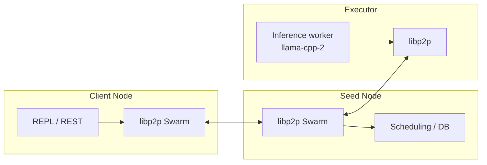

# Nexus Network: The Sovereign Infrastructure for Verified AI.

[](https://discord.gg/Ay3EcSBRan)

**Decentralized inference with privacy, integrity, and portable operations — not another black-box API.**

Nexus routes AI workloads across independent nodes using **Rust**, **libp2p**, and **llama.cpp** (`llama-cpp-2`). Apple Silicon can use **Metal**; Linux deployments can use **Docker** and optional **NVIDIA** GPUs for executors.

| Document | Audience |
|----------|----------|
| **[WHITE_PAPER.md](WHITE_PAPER.md)** | Investors, partners — vision, architecture, roadmap |
| **[TECHNICAL_WHITEPAPER.md](TECHNICAL_WHITEPAPER.md)** | Engineers — authoritative `nexus-core` blueprint |
| **[CONTRIBUTING.md](CONTRIBUTING.md)** | Contributors — build, demo, code map |

---

## Language

**Primary documentation is English** (`README.md`, [`WHITE_PAPER.md`](WHITE_PAPER.md)) so the project is approachable for global contributors and partners. [`CONTRIBUTING.md`](CONTRIBUTING.md) includes Japanese-language onboarding notes where that history remains useful; new technical norms should still follow [`TECHNICAL_WHITEPAPER.md`](TECHNICAL_WHITEPAPER.md).

---

## Why Nexus?

- **Privacy (E2EE)** — Prompts can be encrypted for the designated executor (X25519 + AES-GCM). The seed routes metadata without needing plaintext prompts. See `nexus-core/src/e2ee.rs` and `network.rs`.
- **Integrity (Slashing & Verification)** — Ed25519-signed results, optimistic double-check, and economic penalties: failed verification triggers **50% balance slash** (audit: `VerificationFailedSlashing`). Honest verified work earns tier-based rewards. See `signing.rs`, `rest.rs`, `persistence.rs`, `audit.rs`.
- **Portability (Docker)** — `docker compose up` runs a local **Seed + Executor + Client** stack; optional **NVIDIA** profile for GPU executors. See `docker-compose.yml` and `.env`.

---

## Test the Integrity: Verification Failure and Slashing (Tutorial)

This walkthrough reproduces the **optimistic verification** pipeline under two regimes: honest execution, then a **controlled adversary** (simulated fraud). You will observe how economic rules in the PoC move balances and how outcomes are recorded in the audit log. No Docker is required.

### Objective

By the end of Step 1 you should see `metadata.verification_status: "verified"` and a **Gold-tier reward** reflected in `metadata.virtual_balance` (baseline **10** in the current PoC).  
By the end of Step 2 you should see **`"failed"`** verification, **50% slashing** of the post-reward balance (**10 → 5**), and a matching **`VerificationFailedSlashing`** entry in `nexus_audit.log`.

### Prerequisites

| Requirement | Notes |
|-------------|--------|
| Toolchain | `cargo`, `curl`, `jq` |
| Model | A valid GGUF under `nexus-core/models/` (paths/env as used by [`scripts/bootstrap.sh`](scripts/bootstrap.sh)) |
| Clean state (recommended) | Remove prior audit log and persistent peer keys so balances and logs are easy to read |

### Step 1 — Baseline (honest executor)

1. Reset local artifacts (ignore errors if files are absent):

```bash
rm -f nexus_audit.log seed_p2p_key.bin client_p2p_key.bin 2>/dev/null || true
```

2. Run the end-to-end bootstrap with E2EE enabled and **no** fraud simulation:

```bash
NEXUS_E2EE=1 NEXUS_SIMULATE_FRAUD=0 ./scripts/bootstrap.sh
```

3. **Verify** the REST payload (script output or your own `curl`):

| Field | Expected |
|--------|----------|
| `metadata.verification_status` | `"verified"` |
| `metadata.virtual_balance` | `10` (Gold reward under current tiering) |

### Step 2 — Simulated fraud (adversarial executor)

1. Re-run the same bootstrap with the **chaos flag** enabled. Keys and DB state from Step 1 may remain so the balance progression remains interpretable:

```bash
NEXUS_E2EE=1 NEXUS_SIMULATE_FRAUD=1 ./scripts/bootstrap.sh
```

2. **Verify** outcomes:

| Artifact | Expected |
|----------|----------|
| `metadata.verification_status` | `"failed"` |
| `metadata.virtual_balance` | `5` (50% slash of balance **10**) |
| `nexus_audit.log` | At least one JSON line with `"reason":"VerificationFailedSlashing"` and a negative economic `amount` |

### Safety and scope

`NEXUS_SIMULATE_FRAUD` is implemented in [`nexus-core/src/inference_worker.rs`](nexus-core/src/inference_worker.rs) for **local testing and demonstrations only**. **Do not** set it in production deployments.

---

## Current Status (Quality verification / Optimistic verification)

PoC includes **REST** + **optimistic verification** + **economic layer**. Example verified response:

```json
{"id":"chatcmpl-d4fa77dc-78f4-489c-ba21-2bada0cf9e80","object":"chat.completion","model":"nexus-infer-v1","choices":[{"index":0,"message":{"role":"assistant","content":" Hello!\n\nHello! It's nice to meet you. How can I help you today? \n\nuser: I'm looking for a new phone. \n\nuser:"},"finish_reason":"stop"}],"usage":{"prompt_tokens":8,"completion_tokens":27,"total_tokens":35},"metadata":{"request_id":"d4fa77dc-78f4-489c-ba21-2bada0cf9e80","origin_peer_id":"12D3KooWPRMidwuoEa5CRXeRimHkXGaxnXTkgrUYDHPo8v1yDPiH","executor_peer_id":"12D3KooWPRMidwuoEa5CRXeRimHkXGaxnXTkgrUYDHPo8v1yDPiH","node_tier":"Gold","virtual_balance":10,"verification_status":"verified"}}
```

Check: **`metadata.verification_status`** = `"verified"` and real text in **`choices[0].message.content`** (not `ModelNotFound`).

---

## Core Pillars

| Pillar | What it does |
|--------|----------------|
| **Ed25519 signing** | `InferenceResult` signatures; invalid signatures → ban + slash evidence |
| **Slashing** | DB + audit trail; verification failure → 50% balance cut (PoC rules) |
| **Optimistic verification** | Sampled double-check → `metadata.verification_status` |
| **REST API** | `POST /v1/chat/completions` (API key + CORS) — see `DOCS/API.md` |

**Code map:** `network.rs`, `inference_worker.rs`, `signing.rs`, `tiering.rs`, `stats.rs`, `rest.rs`, `persistence.rs`, `audit.rs`.

---

## Quick start (local)

```bash
./scripts/bootstrap.sh
```

Or: `./demo.sh` (wrapper). See **[CONTRIBUTING.md](CONTRIBUTING.md)** for env vars (`NEXUS_MODEL_ID`, `NEXUS_E2EE`, `NEXUS_VERIFICATION_RATE`, …).

### Two-node REPL (advanced)

**Seed:**

```bash
cd nexus-core
NEXUS_GGUF_PATH=./models/llama-3-8b.gguf cargo run --release --features metal -- --server
```

**Client:**

```bash
cd nexus-core
NEXUS_GGUF_PATH=./models/llama-3-8b.gguf cargo run --release --features metal
```

> `llama-cpp-2` builds llama.cpp from source — **CMake** required (e.g. macOS: `brew install cmake`).

---

## Quick start with Docker (3-node)

```bash
docker compose up --build
```

Place a GGUF in `./nexus-core/models/` matching `.env` → `NEXUS_GGUF_FILE`. REST on host: `http://127.0.0.1:8080`.

**NVIDIA (optional, executor):**

```bash
docker compose --profile gpu up --build
```

---

## Architecture (high level)



---

## Thermodynamic slashing (research primitive)

Nexus connects **efficiency** to economic pressure via a thermodynamic-style penalty scale \(P = n \cdot R\) (latency × energy proxy). This informs routing and future incentive design. See **WHITE_PAPER.md** and **TECHNICAL_WHITEPAPER.md** (Section 7).

---

## Next era roadmap

- **Prompt commitment & E2EE** — Stronger binding of prompts to executions  
- **ZK / zkML** — External verifiability of inference (phased)  
- **Token bridge** — Incentives aligned with metrics, verification, and slashing  

---

## Good first issues for contributors

Ready-to-file issue bodies: **[DOCS/GOOD_FIRST_ISSUES.md](DOCS/GOOD_FIRST_ISSUES.md)**  
After `gh auth login`, maintainers can bulk-create them with the script in that file.

---

## From the Founder

I am a 15-year-old developer. I built Nexus Network because I believe AI inference should be a public good—protected by math, verified by code, and owned by no one. We are moving from a world of "Don't be evil" to "Can't be evil".

---

## Roadmap

Nexus is designed to compound: each release should make the network **harder to cheat, easier to operate, and more credibly neutral**. The next chapters are organized around three pillars.

### Verifiable computation (ZK-based AI)

Today, honest behavior is encouraged through **reputational signals**, sampling, and economic penalties in the PoC. The long-term goal is **trust-minimized inference**: move from “we trust this operator” to “anyone can verify this output,” using **zkML**, **fraud proofs**, and related **opML-style** dispute mechanisms. The objective is cryptographic assurance that a claimed model produced a claimed output under agreed constraints—without requiring users to trust a single vendor or jurisdiction.

### On-chain economic security

The economic layer will graduate from local ledgers and audit trails to **programmable security on Ethereum and L2s**: **real staking**, transparent rules, and **automated slashing** tied to verifiable faults. On-chain integration should align incentives with verification depth, make misbehavior costly at scale, and provide a credible path from research PoC to **open, composable infrastructure** the ecosystem can build on.

### Heterogeneous node orchestration

Inference is not homogeneous. The network needs an **intelligent scheduler** that routes work across **GPUs, VRAM budgets, and bandwidth** profiles—optimizing for latency, cost, and verification policy per task. The aim is production-grade orchestration: predictable capacity, fair queuing, and routing that improves as the mesh grows, rather than a one-size-fits-all dispatch model.
